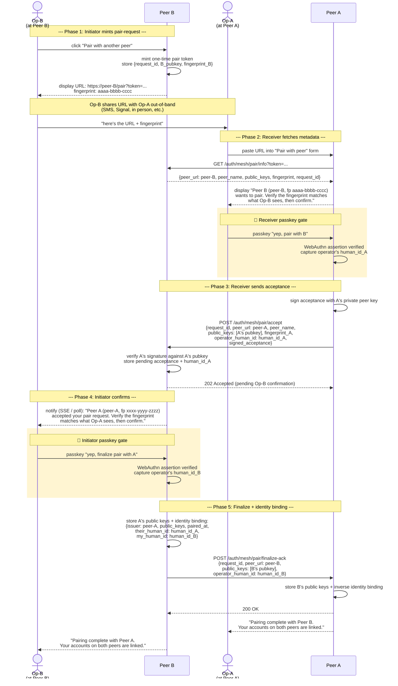
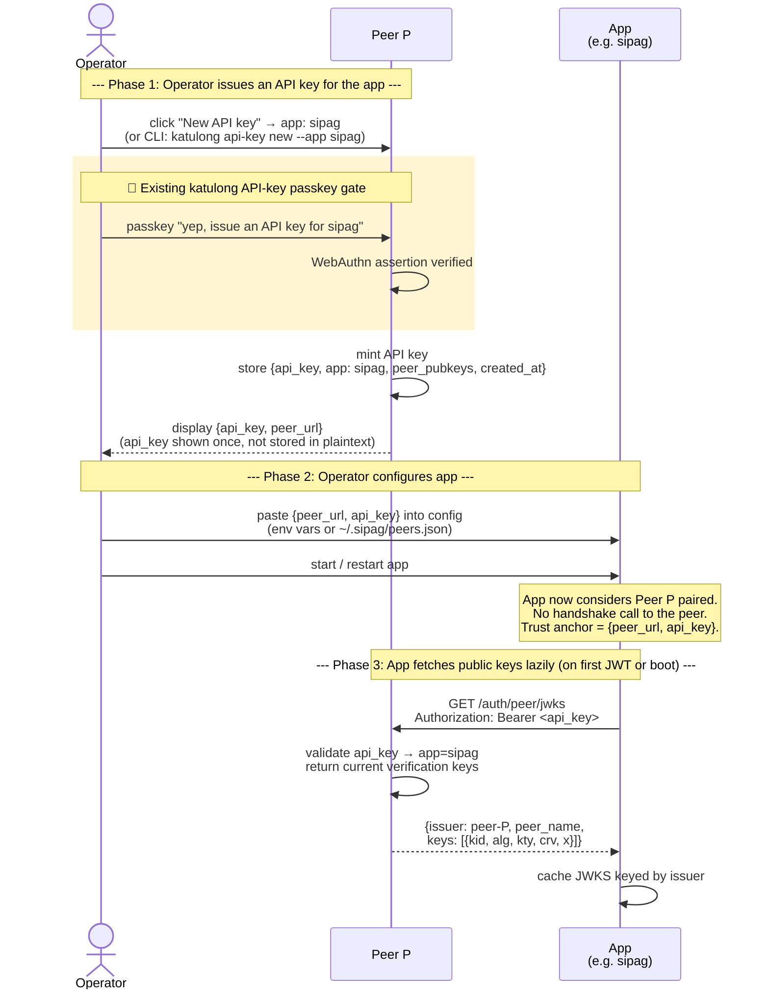
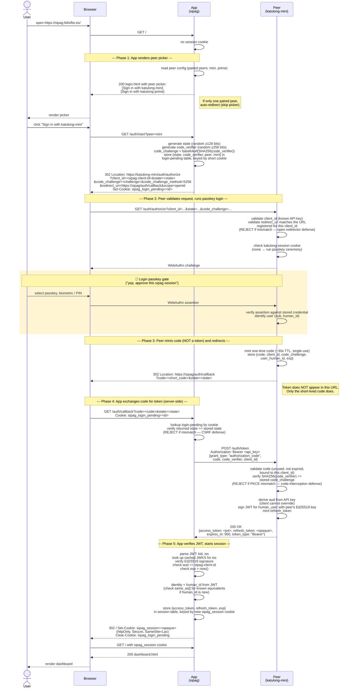
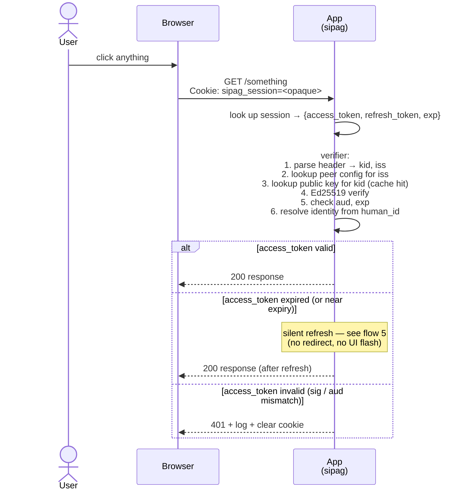
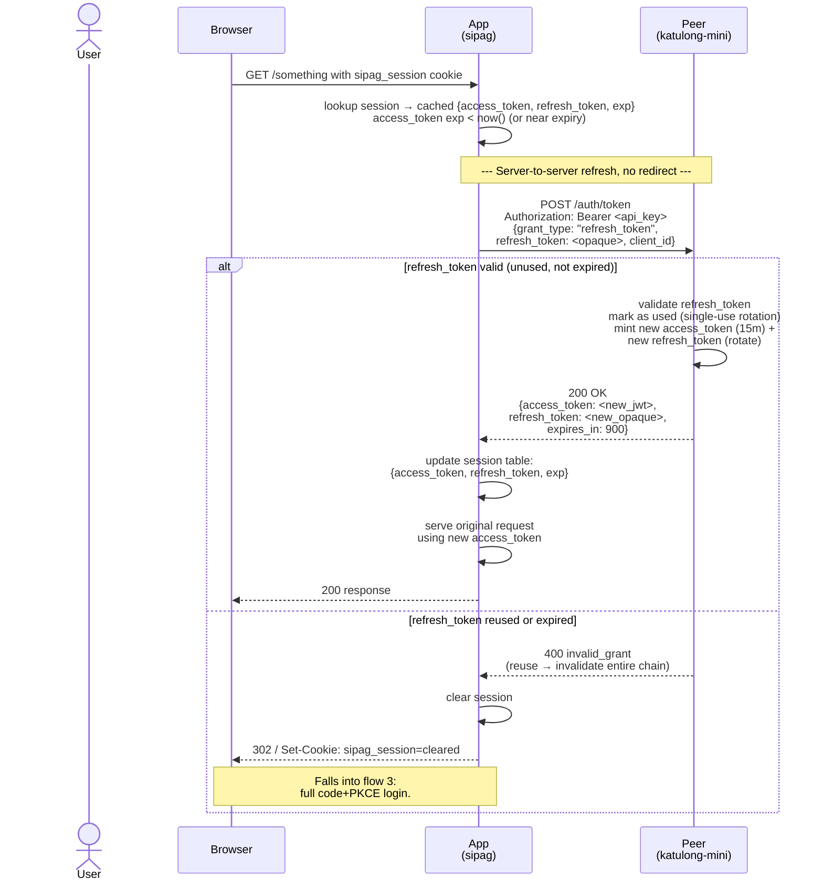
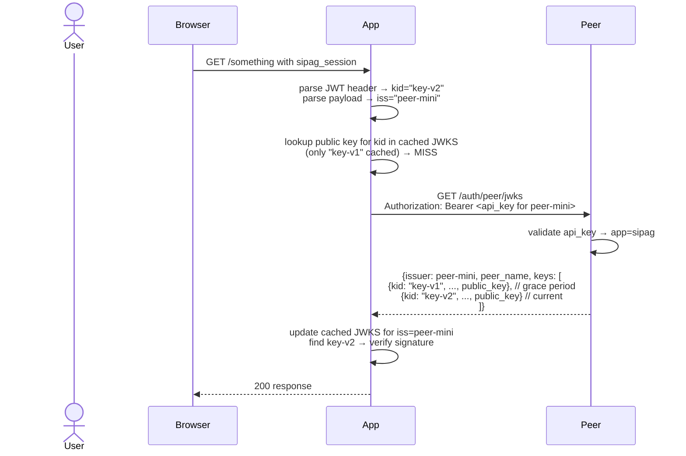
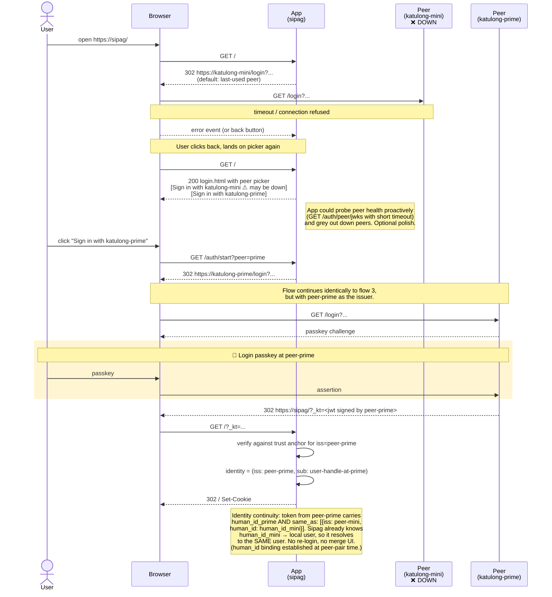

# Auth-as-a-Service — flow diagrams

> **Companion to:** [`AUTH-AS-A-SERVICE.md`](./AUTH-AS-A-SERVICE.md)
> **Status:** draft for review.
> **Purpose:** make the proposed ceremonies concrete enough that we can argue about specific steps instead of abstract architecture.

These diagrams cover every interaction in the proposal:

1. [Peer↔peer pairing (bilateral, mutual passkey confirmation)](#1-peerpeer-pairing-bilateral)
2. [App↔peer pairing (existing API-key flow, no new ceremony)](#2-apppeer-pairing-existing-api-key-flow)
3. [First-time login (user signs in to an app)](#3-first-time-login-user-signs-in-to-an-app)
4. [Per-request verification (steady state)](#4-per-request-verification-steady-state)
5. [Token renewal (when the app's session token expires)](#5-token-renewal)
6. [JWKS refresh (kid miss / key rotation)](#6-jwks-refresh-kid-miss--key-rotation)
7. [Peer outage / failover (when the chosen peer is down)](#7-peer-outage--failover)

---

## Conventions used in these diagrams

**Actors:**

- `Op-A`, `Op-B` — the human operator at peer A or B (during a peer-peer pairing).
- `User` — the end-user signing in to an app. Same kind of human as `Op`, different role.
- `Browser` — the user's web browser. Shown as its own actor when redirects matter.
- `Peer A`, `Peer B`, `Peer P` — katulong instances. UI + server are folded into one actor; HTTP requests originate from the browser unless noted.
- `App` — a generic verifier service like sipag. Has no human at its keyboard.

**Visual conventions:**

- 🔐 **boxed regions** mark the moments where a passkey gesture is required ("yep, I'm a real human and I approve this risky action"). These are the only places the passkey appears. Outside these boxes, all trust flows over signed messages.
- `-->>` (dashed arrow) is a response.
- Notes below an arrow describe what's in the message body.

---

## 1. Peer↔peer pairing (bilateral)

**What this is:** establishing mutual trust between two katulong peers so each can verify tokens issued by the other. Both operators must passkey-confirm. A stolen pair URL alone cannot complete the ceremony.

**Trigger:** operator at one peer wants to pair with another peer they have console access to (or can get on a video call with).

**Why two passkey gates:**
- Without Op-A's gate: anyone who steals the pair URL can complete the ceremony from peer A's network.
- Without Op-B's gate: anyone who can talk to peer B's API (e.g. via the tunnel) can spoof an acceptance and inject themselves as a paired peer.

Both gates close the gap between "knowing the URL" and "actually approving the pair", on each side.

**Identity binding as a free byproduct:** the passkey gates identify a specific human on each peer. Since both gates fire in the same ceremony with the same human present at both ends, each peer learns the other's `human_id` for that human. From now on, tokens issued by either peer for this human carry both the local `human_id` and a `same_as` claim pointing at the other peer's `human_id`. Apps see the `same_as` and treat both as the same user — no manual user-merge UI required.

**Fingerprints displayed at both UIs:** both operators should see the *other* peer's fingerprint and verify it out-of-band ("does the URL you sent me show fingerprint `xxxx-yyyy-zzzz`?"). This catches MITM on the URL-sharing channel.

---

## 2. App↔peer pairing (existing API-key flow)

**What this is:** an app (like sipag) is told "trust this peer's tokens" by being given an API key for that peer. No new ceremony — this reuses katulong's existing API-key issuance flow, which is already passkey-gated. The "pairing" is just the operator generating an API key for the app and pasting it into the app's config.

**Trigger:** operator wants a new app to verify tokens issued by a particular peer.

**Why this is just the API-key flow, not a new ceremony:**
- Generating an API key on a peer is already a passkey-gated operation in katulong. No new "pair" UI, no new endpoint, no new state on the peer beyond what the API-key system already tracks.
- The app's trust anchor is just `{peer_url, api_key}`. The peer's URL tells the app which `iss` to trust; the API key tells the peer which app is calling.
- JWKS is fetched on-demand using the API key. Public keys aren't secret, but gating the endpoint behind the API key gives the peer per-app rate-limiting, audit logging, and revocation for free.
- Revoking an app's access = revoking its API key. Existing flow, no new logic.

---

## 3. First-time login (user signs in to an app)

**What this is:** OAuth 2.1 authorization code flow with PKCE. The user opens an app, has no session yet, gets routed through one of the app's paired peers to authenticate. The peer's existing passkey-login flow is the gate. The token is exchanged server-to-server — never traverses a URL.

**Trigger:** user navigates to `https://sipag.felixflor.es/` with no cookie.

**Where the passkey appears:** only at the peer-side login step. The token that flows back to sipag carries no passkey material — it's a peer-signed JWT. Sipag verifies it offline against cached JWKS.

**Why three layered defenses (state + PKCE + redirect_uri registration):**
- `state` defeats CSRF on the redirect-back: an attacker cannot forge a callback URL because they don't know the random `state` the app stored.
- PKCE (`code_challenge` / `code_verifier`) defeats code interception: even if an attacker observes the code in the redirect URL, they cannot exchange it without the `code_verifier`, which never leaves the app's server.
- `redirect_uri` registration defeats open-redirector: peer rejects any callback URL that doesn't match what was registered with the API key, so an attacker cannot redirect a successful login to attacker-controlled site.

**Why the token never traverses a URL:** unlike OAuth's deprecated implicit grant, the access token only appears in the response body of `/auth/token`. URL bars, browser history, `Referer` headers, and proxy logs never see it. This eliminates the entire token-leak-via-URL class of vulnerabilities.

---

## 4. Per-request verification (steady state)

**What this is:** the app has a session cookie. For each request, it pulls the cached token and verifies it. Pure local crypto — no network calls in the hot path.

**Cost per request:** one map lookup (trust anchor by iss), one map lookup (key by kid), one Ed25519 verify (~50µs). Effectively free.

---

## 5. Token renewal (silent refresh-token exchange)

**What this is:** the access token has expired (default 15m). The app refreshes it server-to-server using the stored `refresh_token` — no redirect, no user interaction, the user keeps using the app uninterrupted. Standard OAuth 2.1 refresh-token rotation with reuse detection.

**Three properties of this flow:**
- **Silent:** no redirect, no passkey re-prompt, no UI flash. The user does not notice renewal.
- **Rotated:** every successful refresh returns a NEW refresh_token; the old one is invalidated.
- **Reuse-detected:** if a refresh_token is presented twice (legitimate app + attacker, or replay attack), the entire refresh chain is invalidated and the user must re-login. This catches most refresh-token-theft scenarios automatically.

The refresh_token never reaches the browser — it lives in the app's server-side session table only. An XSS in the app cannot steal it. An access-token leak (15m TTL) is the maximum exposure window.

---

## 6. JWKS refresh (kid miss / key rotation)

**What this is:** a peer rotates its signing key (every 90d, proposed). Apps that have the old `kid` cached encounter a token with an unknown `kid` and refresh.

**Grace period:** when a peer rotates, it keeps the previous public key in JWKS for one extra rotation cycle so already-issued tokens still verify until they expire naturally. New tokens are signed with the new key.

**Failure mode:** if the peer is unreachable when an unknown `kid` appears, the app cannot verify the token. App's options: (a) reject (treat as invalid token, 401, force re-login); (b) serve stale (allow last-known cache to verify older `kid`s only — won't help here since the `kid` is unknown). Default: (a).

---

## 7. Peer outage / failover

**What this is:** sipag is paired with both `peer-mini` and `peer-prime`. The user normally logs in via `peer-mini`, but `peer-mini` is down. Sipag falls back to the picker and the user signs in via `peer-prime`.

**Identity continuity is automatic** if the two peers were paired via the bilateral peer-pair flow (see flow 1). The pair ceremony bound the operator's `human_id`s across peers, so tokens from either peer carry `same_as[]` linking back to the other. Sipag treats them as the same user without any merge UI.

**Pre-existing tokens keep working:** if the user was already logged in before peer-mini went down, their existing access_token continues to verify (cached public key for peer-mini is still valid) until it expires (~15m). At refresh time, sipag's POST to peer-mini's `/auth/token` fails (peer down) and the user is bounced to the picker — but identity continuity via `human_id` means signing in via peer-prime puts them right back in their existing sipag session.

---

## What's not diagrammed (out of scope here)

- **Operator UI flows** (how the "Pair with another peer" button looks, how the picker is rendered). These are UX-level and belong in a separate doc once the wire flows are agreed.
- **CLI flows** (`katulong peer-token <app>`). Same shape as the UI flows minus the browser actor.
- **Logout.** Per-app: delete the app's session cookie. Per-peer: hit the peer's existing `/auth/logout`. There is no logout-everywhere broadcast (see "Out of scope" in main doc).
- **Audit log entries.** Every passkey gate should produce an audit record on the peer side. Format TBD.

---

## Things to look at while reviewing

1. **Are the bilateral pair phases right?** Specifically Phase 3 (receiver POSTs to initiator) — is the "receiver-pushes" direction correct, or should the initiator poll? Push is simpler if both peers can reach each other over the tunnel; poll is more robust if not.
2. **Phase 4's notification mechanism.** SSE on the initiator's UI? Polling? Either works — SSE is nicer UX.
3. **Fingerprint format.** Proposal: short hash of the peer's first public key, displayed as `xxxx-yyyy-zzzz`. Real users skip "compare these characters" steps (Signal-safety-number problem). Worth iterating to QR + on-device verification or 6-digit SAS in v2.
4. **Refresh-token lifetime + rotation policy.** Flow 5 uses 30d single-use rotation with reuse detection. 30d means a long-idle user re-logins at most monthly. Too short = annoying; too long = stale revocation. Match GitHub's 30d?
5. **`human_id` binding for non-operator humans.** The bilateral peer-pair binds the operators' identities for free. Other humans need a separate "bind these accounts" ceremony. Concrete UX deferred to a separate doc — for dorky-robot's actual user (one human), this isn't urgent.
6. **Peer health probing in flow 7.** Worth doing proactively to grey out down peers in the picker, or wait until users hit it?
7. **Login-pending storage.** Flow 3 stores `{state, code_verifier, peer}` in a server-side login-pending table keyed by a short browser cookie. TTL on that cookie? Proposal: 5 minutes (the user has to complete the flow within that window, otherwise restart). Cleanup of stale rows?
