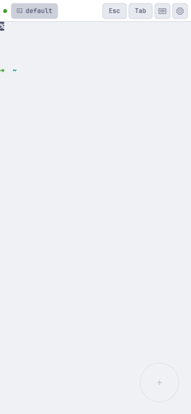
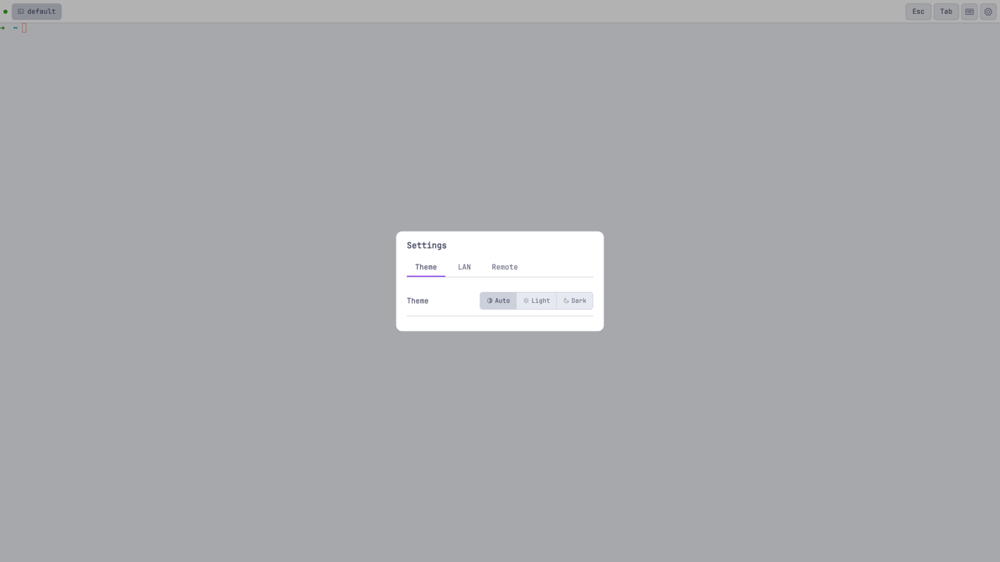
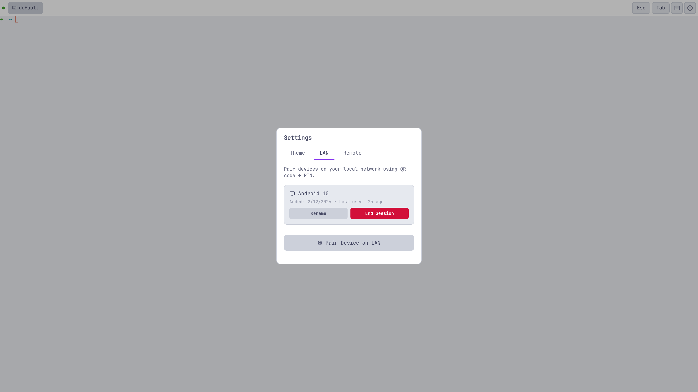
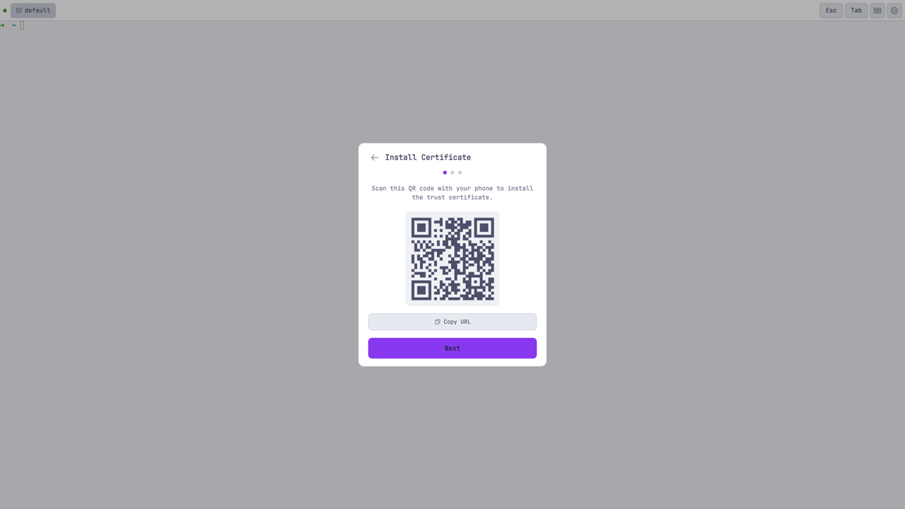
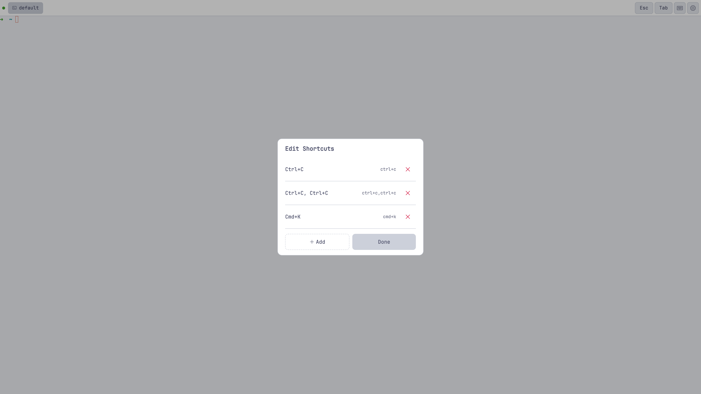

# katulong

<div align="center">


</div>

A self-hosted web terminal that gives you shell access from any device over HTTP/HTTPS + WebSocket.

## Why "katulong"?

*Katulong* (kah-too-LONG) is Tagalog for *helper*.

Not assistant, not agent, not copilot — helper. The word carries a specific weight in Filipino culture: a katulong is someone who shows up, does the work alongside you, and makes the hard parts easier. They don't take over. They don't need to be managed. They're just there when you need them.

That's what this project is. You're already doing the work — building, deploying, debugging. Katulong just makes sure your terminal is there when you reach for it, whether you're at your desk, on the couch with your phone, or on a tablet across the house.

The name is a reminder of the intent: serve the person doing the work, don't get in their way.

## The problem

Your terminal is trapped on your laptop.

You start a long build. You go make coffee. You want to check if it's done from your phone — but you can't, because your terminal doesn't leave the machine it's running on.

You start debugging on your laptop, realize you need to context-switch to your desktop for the bigger screen. You try to pick up where you left off, re-navigate to the directory, try to remember where you were. The flow is broken.

Every solution involves tradeoffs: tmux requires port forwarding, which requires a static IP or a VPN or a tunnel service. Cloud terminals require trusting a third party with shell access to your machine. Screen sharing works but it's slow and coarse.

The core issue: there's no simple way to access your shell sessions from wherever you happen to be, on whatever device you happen to have.

## The idea

Katulong takes a different approach. Your terminal sessions live in tmux on your machine. A web server manages them in-process, serving an xterm.js terminal over HTTP and WebSocket. Open a browser — any browser, any device — and you're connected.

```bash
katulong start
```

That's it. Your terminal is now available at `https://your-machine:3001` from any device on your network. Phone, tablet, another laptop — if it has a browser, it's a terminal.

```
Phone browser  ──WebSocket──┐
                             ├── Server (server.js) ── tmux sessions
Desktop browser ──WebSocket──┘   Session manager         PTY processes
                                 Auth middleware          Output buffers
```

Sessions are backed by tmux, so they persist independently of the server. Restart the server, your sessions survive. The browser reconnects and replays the output buffer. You pick up exactly where you left off.

Sessions are named. `/?s=deploy` connects to a session called "deploy". Open the same URL in two windows and you're sharing the session in real-time. Close all windows, come back tomorrow — the session is still there.

### Security

This application provides direct terminal access to your machine. Security isn't optional.

First device registers via WebAuthn passkey. Subsequent devices pair via QR code + 6-digit PIN. Localhost bypasses auth. LAN and remote connections require a valid session cookie. Sessions are 30-day tokens, server-side, pruned on expiry.

No passwords to manage. No tokens in URLs. No `X-Forwarded-*` header trust. The only thing that proves identity is a cryptographic passkey or a physically-proximate pairing flow.

## Install

### Homebrew (macOS)

```bash
brew tap dorky-robot/katulong
brew install katulong

katulong start

# Or auto-start on login
brew services start katulong
```

### Manual

```bash
git clone https://github.com/dorky-robot/katulong.git
cd katulong
npm install
npm link  # Makes 'katulong' command available globally
```

## Updating

```bash
katulong update
```

Katulong detects how it was installed (Homebrew, npm global, or git clone) and runs the appropriate update. If the server is running, it performs a rolling restart — the new version starts up while the old one drains, so your terminal sessions are never interrupted.

```bash
katulong update --check       # Check if an update is available without applying it
katulong update --no-restart  # Update the code but skip the rolling restart
```

Sessions live in tmux, which is independent of the server process. During a rolling restart, the browser automatically reconnects to the new server and replays your scrollback. Typical downtime is 2-5 seconds.

## Quick start

```bash
katulong start        # Start the server
katulong status       # Check if it's running
katulong open         # Open in your default browser
katulong logs         # View logs
katulong update       # Update to the latest version
katulong stop         # Stop everything
```

Visit `/` for the default session. Visit `/?s=myproject` for a named session. That's the whole interface.

For detailed CLI usage, run `katulong --help`.

## A walkthrough: your terminal follows you

You're at your desk. You start a deploy:

```bash
# Open a browser to your katulong instance
# Navigate to /?s=deploy
$ git push origin main && ./scripts/deploy.sh
```

The deploy is running. You grab your phone, walk to the kitchen, open `https://your-machine:3001/?s=deploy` in mobile Safari. The terminal is there — same session, same output, scrollback intact. The deploy finishes. You see it on your phone.

Back at your desk, you notice a bug in staging. You open `/?s=debug` on your desktop's bigger monitor. You start digging. Your laptop still has `/?s=deploy` open — two sessions, two devices, no conflict.

One server. Multiple windows. Your work follows you.

## Features

### Mobile-first terminal
- **Full-screen text input** — Dedicated textarea for commit messages, docs, or long-form text. Works with your phone's speech-to-text.
- **Swipe navigation** — Touch zone for arrow keys. Swipe to navigate without obscuring the terminal.
- **Smart keyboard handling** — Autocorrect and autocapitalize disabled. Virtual keyboard detection keeps the terminal in view.
- **PWA-ready** — Install as a full-screen app. No app store needed.

### Session management
- **Named sessions via URL** — `/?s=myproject` connects to a session called "myproject"
- **Sessions survive restarts** — Backed by tmux. Restart the server, your sessions are still there.
- **Shared sessions** — Same URL in multiple windows = shared terminal
- **Session manager** — Create, rename, delete sessions from the UI

### Self-updating
- **One-command update** — `katulong update` detects install method and does the right thing
- **Rolling restart** — New server starts before old one exits. Sessions survive with ~2-5s reconnect.
- **Update check** — `katulong update --check` to see if a new version is available without applying it

### Power user features
- **Configurable shortcuts** — Pinned keys in the toolbar, full list in a popup
- **Cmd/Option key support** — Cmd+Backspace (kill line), Option+Backspace (delete word)
- **Touch-optimized toolbar** — Essential keys always accessible

### Screenshots

<div align="center">










</div>

## Architecture

```
Browser  <──WebSocket──>  Server (server.js)
                          HTTP + static files
                          Auth middleware
                          Session manager ── tmux sessions
```

- **`server.js`** — HTTP + WebSocket server. Routes, auth middleware, session management.
- **`lib/session-manager.js`** — Terminal session lifecycle via tmux control mode.
- **`lib/session.js`** — Session class, tmux helpers, RingBuffer.
- **`public/index.html`** — SPA frontend. xterm.js terminal, shortcut bar, settings.
- **`lib/auth.js`** — WebAuthn registration/login, session token management, passkey storage.

Sessions are backed by tmux — restart the server freely without losing terminal sessions. On restart, the browser reconnects and replays the output buffer.

### REST API

| Method | Endpoint | Description |
|--------|----------|-------------|
| GET | `/sessions` | List all sessions |
| POST | `/sessions` | Create a session `{ "name": "..." }` |
| PUT | `/sessions/:name` | Rename a session `{ "name": "..." }` |
| DELETE | `/sessions/:name` | Kill and remove a session |
| GET | `/shortcuts` | Get shortcut config |
| PUT | `/shortcuts` | Update shortcut config |

### Environment

| Variable | Default | Description |
|----------|---------|-------------|
| `PORT` | `3001` | Server port |
| `SHELL` | `/bin/zsh` | Shell to spawn in sessions |

## Development

```bash
npm install           # Install dependencies
npm run dev           # Run server with auto-reload
npm test              # All tests
npm run test:unit     # Unit tests only
npm run test:e2e      # End-to-end tests (Playwright)
```

Open `http://localhost:3001` in a browser.

For production deployment, use the `katulong` CLI (see Install above).

## License

MIT
