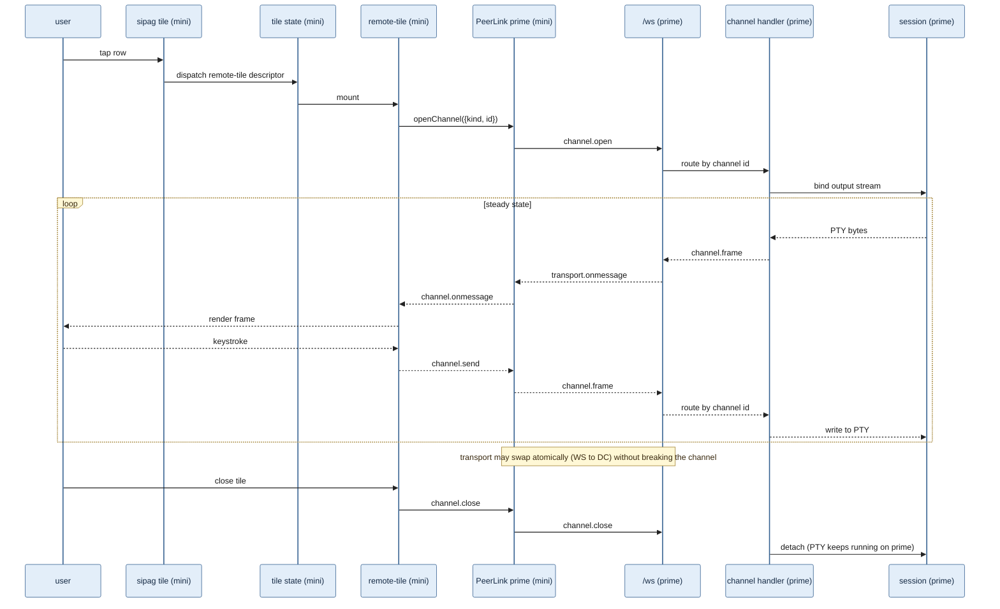

# Cross-instance tile rendering

> **Destination:** move to `katulong/docs/cross-instance-tiles.md`.
> **Supersedes:** `docs/federated-chat-and-tile-sharing.md` (delete or
> annotate as parked once this lands — chat is out of scope; the
> tile-sharing parts are reframed here for a single-user-multi-machine
> workload).

## Why this exists now

A real workflow surfaced the use case:

- Sipag, the dorky-robot OKR/observation board, polls every katulong
  instance in the user's mesh (mini, prime, og) and surfaces sessions
  in a unified "live activity" tray.
- Tapping a session in sipag should open it as a *native* tile in
  whatever katulong UI the user is currently in, regardless of where
  the session is physically running.

The current shape (sipag's tap → `<a href>` → external browser tab,
or `<a href>` → katulong PWA on the right hostname → new window per
host) breaks the "single pane" intent of the unified board. The user
ends up with N PWA windows on the iPad, one per katulong host they've
touched.

The previous design (`federated-chat-and-tile-sharing.md`) reached
for a similar shape but framed it around *pair-programming between
strangers*. With strangers, peer-link-as-authorization and chat make
sense. For a single user with three machines they own, the trust
model is simpler and the chat side is irrelevant. This doc rewrites
the tile-sharing parts in that simpler frame.

## What carries forward (do not re-litigate)

These principles came out of scar tissue and stay binding.

1. **The transport is the connection.** From `connection-rewrite.md`:

   > Connection liveness means "can I send data and get a response."
   > That's a property of the transport, not of the underlying
   > WebSocket. Heartbeat, reconnection, and status all work through
   > `transport.send()` / `transport.onmessage`.

   No code in this design names a specific wire. WS today, WebRTC
   tomorrow, anything else after — interchangeable behind the
   transport surface.

2. **Atomic single-active-transport invariant.** From the WebRTC
   add/remove/re-add diwa thread (commits `3756516`, `9b13326`,
   `a7519f5`):

   > only ONE transport carries data at a time — the switch is
   > atomic with no gap and no overlap. WebSocket always stays alive
   > for signaling even during DataChannel mode.

   The peer-link below honors this: it's a single channel that may
   atomically swap its underlying wire.

3. **Tiles are descriptors, not objects.** From
   `rewrite-tile-protocol.md` and `tile-state-rewrite.md`: a tile is
   a `{ id, type, props }` record; the renderer is a pure function of
   props. No per-tile classes with lifecycle the host has to call in
   the right order. Cross-instance is just a new `type`.

## What does *not* carry forward

The previous design's framing assumes things this design rejects.

- **Chat between katulong instances.** Out of scope. We don't have a
  use case for it. If one shows up, it's a separate doc.
- **Pair-programming with strangers.** The "peer link IS the
  authorization, revocable per-tile" framing was right *for that
  threat model*. We don't have that threat model — the user owns
  every host. Simpler model: bearer-token apikey on the receiving
  katulong, same primitive the rest of katulong's API already uses.
- **The `dorkyrobot.com` managed signaling relay.** Not needed when
  every endpoint already has a known public hostname via
  `tunnels`. Direct peer setup over the existing tunnel infrastructure.

## First principles for this design

1. **Single-user, multi-machine.** All katulongs in the mesh are
   trusted. Auth is bearer-token, not peer-pairing ceremony. A
   compromise of one host is mitigated by minting per-purpose apikeys
   (`peer:prime→mini`, etc.) — same shape as the existing
   `sipag-observer` apikey.

2. **Federation is a tile type.** A `remote-tile` descriptor names a
   peer and a target. The renderer pipes frames in, events out, over
   a peer-link. Nothing else in the tile system needs to change.

3. **Transport-agnostic at every layer.** The peer-link exposes the
   same `send` / `onmessage` surface as the in-instance transport.
   `remote-tile`'s renderer doesn't know whether bytes flow over WS,
   DataChannel, or some yet-unwritten transport. The transport layer
   handles atomic upgrade/downgrade and stays invisible above.

4. **No new server endpoint shape.** A peer connecting to receive
   tile streams uses the same `/ws` endpoint local clients already
   use. The auth is bearer-token instead of session cookie, but the
   message protocol is identical. A peer is "another client of this
   katulong's WS".

5. **Sipag is a consumer, not a participant.** Sipag observes
   sessions across the mesh and surfaces them. When a sipag link
   resolves to a known peer, the click dispatches a `remote-tile`
   descriptor. When it doesn't, it falls back to a regular link
   (today's behavior). Sipag does not implement federation logic
   itself.

## Architecture

### Component view

The architecture in table form. (Mermaid flowcharts in this codebase
currently strip node-label text via `DOMPurify` interaction — tracked
as a separate fix; until then, the table is the source of truth and
the sequence diagram below covers the dynamic behavior.)

| # | Component | Lives on | Role |
|---|---|---|---|
| 1 | **user** | iPad / browser | Looking at katulong-mini's UI; taps a row in sipag's live activity tray |
| 2 | **sipag — live activity tray** | katulong-mini | Surfaces sessions across all configured peers; on tap dispatches a tile descriptor |
| 3 | **tile state atom** | katulong-mini | Holds `{ type: "remote-tile", props: { peer, target } }` — single source of truth for layout |
| 4 | **remote-tile renderer** | katulong-mini | New tile type. Pipes inbound frames to a local-tile renderer, sends outbound input over the channel |
| 5 | **PeerLink prime** | katulong-mini | One per swarm member sipag wants to talk to. Owns the transport. Surface: `transport.send` / `onmessage`. Wire-agnostic. Member discovery via gossip — see "Swarm membership" |
| 6 | **transport edge** | between mini ↔ prime | WebSocket today, DataChannel-upgradable, future transports interchangeable. Single-active-transport invariant |
| 7 | **`/ws` member-sig auth** | katulong-prime | Same `/ws` endpoint local clients use. Auth via cookie (local) OR a swarm-member signature (peer). Existing apikey-bearer path stays for non-peer clients (sipag's observer, etc.) |
| 8 | **tile-channel handler** | katulong-prime | Multiplexes channels over the peer link. `channel.open` / `channel.frame` / `channel.close` |
| 9 | **session viewer** | katulong-prime | Same code path the local UI uses to bind to a session — proves "remote tile" reuses local rendering |
| 10 | **tmux session** | katulong-prime | The actual PTY. Stays running on prime regardless of which katulongs are viewing it |

Data flow: user (1) → sipag (2) → state (3) → remote-tile (4) ↔
PeerLink (5) ↔ transport edge (6) ↔ `/ws` (7) → handler (8) → viewer
(9) → tmux (10). Frames flow up; input events flow down.

### Channel lifecycle



## Components

### Swarm membership — gossip, not manual pairing

Manual N×N pairing doesn't scale and doesn't match how the user
actually thinks about the mesh ("my katulongs"). When you bring a
new katulong online — install on a new Mac, restore from backup,
spin up a tunnel-only instance — you should pair *once* with any
existing member and the new instance auto-discovers all the others.

That's a swarm membership protocol. Concretely:

- **Each katulong has an identity keypair** (Ed25519). The public key
  is the member's stable id. Generated on first run; persisted in
  config.
- **Each member maintains a swarm view** — a set of records
  `{ memberId, url, advertisedSince, vouchedBy[] }`. `vouchedBy` is
  the list of public keys that have signed a "this member is in our
  swarm" attestation for this entry.
- **Joining the swarm**:
  1. New katulong runs `katulong swarm join <url-of-any-existing-member>`.
  2. New katulong sends its pubkey + a desired url over the same
     `/ws` peer-channel infrastructure described below.
  3. The existing member presents an interactive confirm (the human
     decides — same trust gate as setup-token pairing today).
  4. On confirm, the existing member signs a vouch for the new
     member, broadcasts the new entry over its peer-links to other
     members, and replies to the new member with the full swarm
     view.
  5. The new member now knows everyone; everyone knows the new
     member.
- **Steady-state gossip**: every member periodically (≈30s) opens a
  channel to a random known member and exchanges swarm views. Both
  sides merge by union-with-newer-wins on `advertisedSince`. New
  members propagate; url updates propagate; only-seen-by-some
  members converge to fully-known.
- **No pre-shared secret per pair**. Auth on the peer-link
  (`/ws` bearer-token) is replaced by membership proof: the
  initiator presents `{ memberId, sig over current timestamp }` and
  the receiver verifies the memberId is in its swarm view + the sig
  validates against the stored pubkey. No apikey rotation per peer.
- **Removal**: `katulong swarm leave` (or `swarm kick <memberId>`
  from any peer) emits a tombstone signed by an existing member.
  Tombstones gossip the same way; members receiving a tombstone
  drop the corresponding entry. Single-user assumption keeps
  revocation simple — there's no "voted out" quorum, any member can
  kick.

Stored in config:

```jsonc
{
  "swarm": {
    "myKey": { "publicKey": "...", "secretKey": "..." },     // 0600
    "members": [
      { "memberId": "...", "url": "https://...",
        "advertisedSince": "2026-04-29T...",
        "vouchedBy": ["..."] }
    ]
  }
}
```

CLI surface (mirrors `katulong apikey` shape):

| Command | Purpose |
|---|---|
| `katulong swarm init` | First-ever member of a new swarm. Generates keypair, no peers. |
| `katulong swarm join <url>` | Pair with any existing member; get full membership. |
| `katulong swarm list` | Show known members + their last-gossiped state. |
| `katulong swarm leave` | Tombstone self, broadcast, exit cleanly. |
| `katulong swarm kick <memberId>` | Tombstone someone else (e.g., lost device). |

API surface — same shape as the existing `/api/config/...` endpoints
but read-mostly (writes happen via gossip ingest, not direct PUT):

| Endpoint | Purpose |
|---|---|
| `GET /api/swarm` | Current swarm view from this member's perspective. |
| `GET /api/swarm/me` | This member's pubkey + url. |
| `POST /api/swarm/join` | Initiate a join handshake against another member. |

Why a vouching key + gossip instead of a single shared swarm secret:
- A pre-shared secret means a compromise on one device exposes the
  whole swarm with no rotation path short of "rotate everywhere at
  once."
- Vouches are per-introduction. If a device is lost, kicking it
  emits a tombstone; new members won't accept old vouches that
  chain back to a tombstoned voucher.
- Single-user assumption keeps the trust math simple — every member
  trusts every other; no quorum or weighted-consensus complexity.

The `remote-tile` renderer described below uses *swarm membership*
as its peer registry. There's no separate `peers: [...]` field
anymore — swarm membership *is* the peer list.

### Peer-link — owns the transport

One PeerLink instance per configured peer, lazy. Created on first
demand (the first `remote-tile` mount that targets that peer).
Reference-counted; closed when the last consumer goes away.

Surface:

```js
const link = peerRegistry.linkTo("prime");
const channel = link.openChannel({
  kind: "session",       // what tile shape to bind to
  id: "passkey-link",    // session id on prime
});
channel.onmessage = (msg) => { ... };
channel.send({ type: "input", data: "..." });
channel.onerror = (err) => { ... };
channel.close();
```

The link manages:
- The single underlying transport (WS first; DC upgrade later)
- Reconnect with backoff (per `connection-rewrite.md`)
- Heartbeat over the same transport (no raw-WS reach)
- Channel multiplexing — many channels, one transport

The link does *not* know what's inside the messages. Channels frame
their own protocols (terminal stream, file-browser updates, future
tile types).

### Server-side: tile-channel handler

On each katulong, the existing `/ws` endpoint gains an
authentication branch:

- Cookie present → existing local-client behavior (unchanged)
- `Authorization: Bearer <apikey>` and the apikey has the `peer-tile`
  capability → peer-client behavior (described below)

The peer-client message protocol matches the existing client
protocol with a small additive layer for channel multiplexing:

```
{ type: "channel.open", channel: "<uuid>", spec: {kind, id, ...} }
{ type: "channel.frame", channel: "<uuid>", payload: <opaque> }
{ type: "channel.close", channel: "<uuid>" }
```

`channel.frame.payload` carries whatever the bound tile-kind
exchanges. For terminal sessions today, that's exactly the bytes
local tiles already exchange — same `data` / `resize` / etc. shapes.

### Client-side: `remote-tile` renderer

A new tile descriptor:

```js
{
  id: "rt-<nanoid>",
  type: "remote-tile",
  props: {
    peer: "prime",
    target: { kind: "session", id: "passkey-link" }
  }
}
```

The renderer:

1. On mount, opens a channel via `peerRegistry.linkTo(props.peer)`.
2. Reads `channel.onmessage` frames and forwards to a *local* tile
   renderer for that kind. For `kind: "session"`, that's the existing
   terminal renderer — same xterm.js, same frame handling, same
   cursor logic. The data path stops at the channel boundary; the
   render path stays native.
3. Outbound input events go via `channel.send({type: "input", ...})`.
4. On reconnect (peer-link's responsibility), the channel is
   re-opened with the same spec; the renderer subscribes again.

The descriptor is persistable (state atom carries it). On katulong
reload, the renderer just re-attaches.

### Sipag integration

Sipag's hosts list comes from `~/.sipag/hosts.toml` today — manual
edits per host. With the swarm in place, sipag's observer can
piggyback on any one katulong's `GET /api/swarm` to discover the
whole mesh automatically. Adding a new katulong = `katulong swarm
join` once, and sipag picks it up on the next observer tick.

Each observation already knows its host. The "live activity" tap
handler becomes:

```js
function openObservation(obs) {
  const member = katulongSwarm.find(m => m.id === obs.host);
  if (member) {
    uiStore.addTile({
      id: `rt-${obs.host}-${obs.session}`,
      type: "remote-tile",
      props: { peer: obs.host, target: {kind:"session", id: obs.session} }
    }, { focus: true, insertAt: "afterFocus" });
  } else {
    // Unknown host (not in swarm view) — fall back to a normal link.
    window.open(`${obs.host_url}/?s=${encodeURIComponent(obs.session)}`);
  }
}
```

Sipag has zero knowledge of how `remote-tile` works or how swarm
membership is established; it just dispatches a descriptor.

## What's deliberately not in this design

| Concern | Disposition |
|---|---|
| Chat between katulongs | Out of scope. Re-open if/when there's a use case. |
| Pair-programming with strangers | Different threat model; needs its own doc. |
| Cluster-shared-as-a-unit | Fine to defer — single-tile is the 90% case. |
| Web components migration | Orthogonal. Can land before, after, or never; doesn't change anything in this design. |
| Input arbitration | Single-user assumption — no concurrent drivers. |
| Per-tile capability scoping (read-only viewing) | Separate apikey scoping work. Mention as follow-up. |

## Web components — explicitly: not the same conversation

The current renderer pattern (`{ type, init, describe, mount }`) is
already descriptor-based and tile-type-extensible. Migrating to
`class extends HTMLElement` buys real things (Shadow DOM
encapsulation, standard plugin shape, no manual lifecycle calls)
but **none of those things are blockers for cross-instance**.
Cross-instance only needs:

1. The peer-link transport
2. The `remote-tile` descriptor
3. The server-side tile-channel handler

Whether the renderer's `mount(el, api)` lives on a plain object or
on a custom element class doesn't matter to any of those three. We
can ship cross-instance now and migrate to web components later, in
either order.

## Implementation phases

The peer-link transport is the longest pole. The swarm layer can
land before or after the channel/tile work — they share the same
`/ws` infrastructure but the tiles themselves don't depend on
swarm to function (they can use a single hardcoded peer until the
swarm lands).

1. **Identity keypair + bare swarm config.** Generate Ed25519 keypair
   on first run, persist in config, expose `katulong swarm me`.
2. **Server: membership-proof auth on `/ws`.** Replace today's
   cookie-only auth with cookie OR `{ memberId, sig }`. Existing
   apikey-bearer path stays for non-peer integrations (sipag's
   observer, ollama bridge, etc.).
3. **Swarm join + gossip.** `katulong swarm join <url>` handshake,
   interactive confirm UI on the receiver, vouch+broadcast, periodic
   pull-gossip with random member, tombstone handling.
4. **Server: tile-channel handler.** `channel.open` /
   `channel.frame` / `channel.close` envelope. For
   `kind: "session"`, bind to the session's existing output stream.
   Same code path whether the channel-opener is a local browser or
   a peer member.
5. **Client: peer-link transport.** Reuse `client-transport.js` /
   `transport-layer.js`. Pointed at a swarm-member's `/ws` with
   member-sig auth. WS only at first; DC upgrade lands separately
   when warranted.
6. **Client: `remote-tile` renderer.** Subscribes to a channel,
   delegates frame handling to the local-tile renderer for that
   kind.
7. **Sipag integration.** Sipag observer reads `GET /api/swarm` from
   any one member, uses that as its host list. Live-activity taps
   dispatch `remote-tile` descriptors when the obs's host is in the
   swarm.

Phases 1–3 are the swarm layer. Phases 4–6 are the cross-instance
tile rendering. They land independently — phase 4–6 can run against
a pre-shared peer config (today's hosts.toml shape) while 1–3 are
built; phase 7 unifies them.

Phases 1–4 are infrastructure. Phase 5 is the tile. Phase 6 is the
user-visible win. Each phase is independently testable; an
intermediate state (peer-link works but no `remote-tile`) is
exercisable via dev tools alone.

## Open questions for review

### Swarm layer

1. **Bootstrap UX.** First-time setup: the user has zero katulongs.
   Install on machine A → `katulong swarm init` (becomes the seed).
   Install on machine B → `katulong swarm join <A's-url>`. Confirm
   on A. Done. Is `swarm init` discoverable enough, or do we want
   an "are you the first?" prompt on first run?
2. **Url advertisement.** Each member advertises a URL in its swarm
   record. Today every katulong has a stable tunnel URL (`tunnels`
   CLI), so this is straightforward. What about LAN-only setups
   without a tunnel — does a member advertise a `*.local`
   address? Multiple addresses per member?
3. **Tombstone TTL.** A tombstone has to outlive any cached
   reference to the dead member or it could resurrect. Permanent
   tombstones grow forever. Sweep at, say, 30 days?
4. **Vouch chain depth.** New member B introduced by A. C joins via
   B. From A's perspective, C is "vouched-by B who is vouched-by
   me." Chain of length 2 is fine. Do we trust arbitrary depth, or
   require every chain-link be re-confirmed by the user on this
   member?
5. **Out-of-band trust.** Some users will want to disable the
   interactive confirm and accept any vouched-by-trusted-member.
   Off by default; opt-in flag in config.

### Cross-instance tile layer

6. **Reconnect storm protection.** If three users on three iPads
   each spawn `remote-tile`s pointing at the same peer, that peer
   gets 3× the channels. Cap channels per peer-link? Per peer-pair?
7. **Persistence on reload.** A `remote-tile` descriptor in state
   re-attaches on katulong reload. What does "the channel is gone
   and has been for 30 minutes" look like in the renderer? An
   error state? A re-attach button?
8. **Capability scoping inside the swarm.** Once you're a member,
   can you do *anything* the host can do, or are there member-level
   caps (e.g., "can view sessions but can't create them")? Default:
   members are fully trusted. Mention as future work.
9. **Sipag's link routing.** Sipag UI doesn't currently know which
   katulong is "the current one" (the one rendering it). Today it
   assumes one tab per host. With this change, sipag needs to know
   the host it's rendered inside so it can dispatch `remote-tile`
   descriptors locally. Easiest: katulong injects a known global
   into sipag's iframe context. Alternatives?
10. **Observation → tile UX.** Today sipag's row is `<a href=...>`.
    For peers, it should still be a link (so non-sipag-aware contexts
    work) but the click handler short-circuits to the descriptor
    dispatch. Does this need a special tile-renderer hook in the
    sipag tile, or is a cross-frame `postMessage` cleaner?

## Asks before moving forward

- Confirm the new framing is right (single-user trust model, no chat,
  no pair-programming-with-strangers).
- Confirm phases — anything that should land in a different order?
- Pick a position on each open question (or defer with an explicit
  "we'll figure it out when we get there").
- Decide whether `federated-chat-and-tile-sharing.md` gets deleted or
  rewritten as a single-paragraph "we considered chat, here's where
  it parked" header pointing at this doc.
