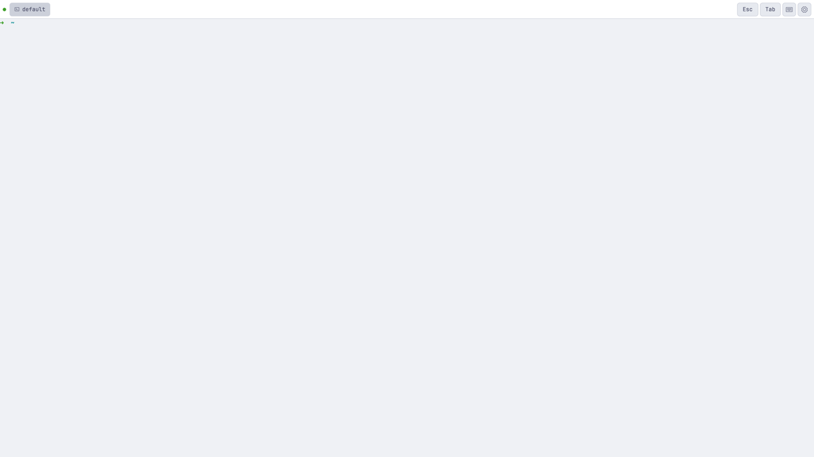
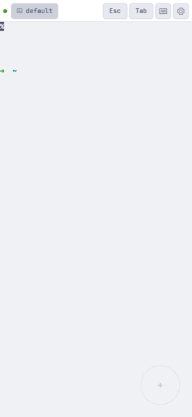
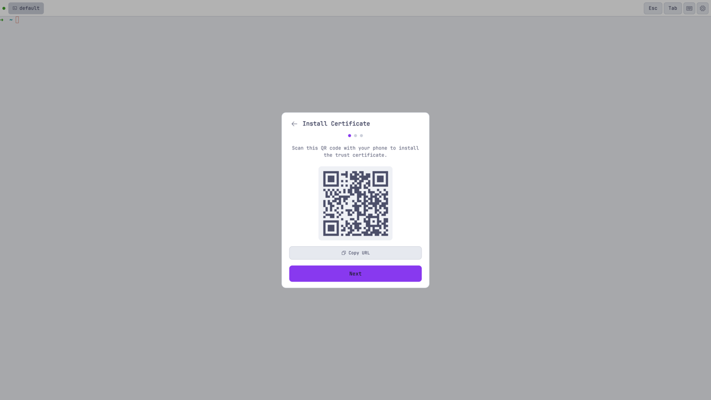
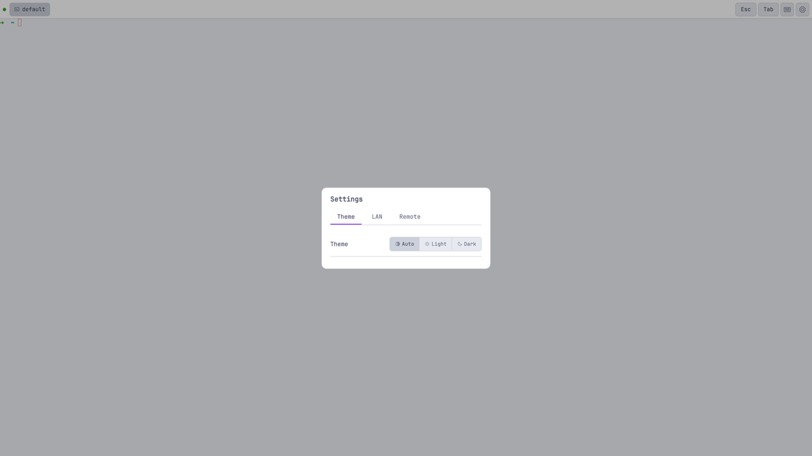
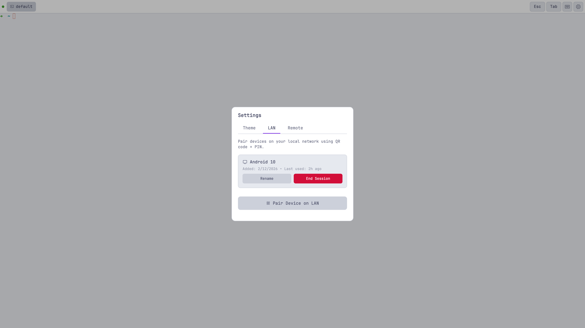
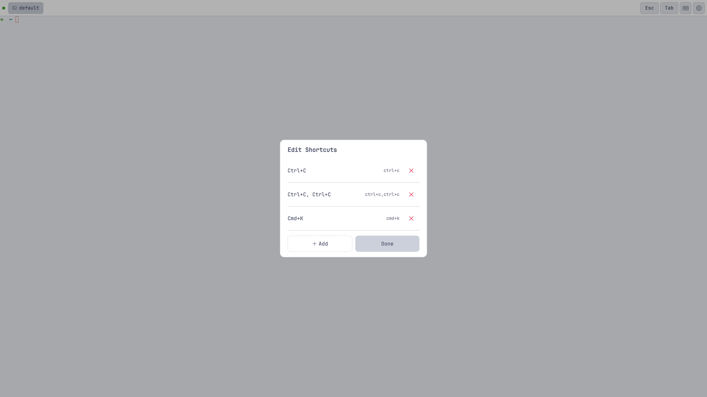

# Screenshots

Beautiful, intuitive interface for terminal access.

## Main Terminal Interface

Main terminal interface with customizable shortcut bar.

## Mobile Terminal

Mobile-optimized terminal with touch controls.

## Device Pairing

Device pairing via QR code + PIN.

## Settings

Settings panel with theme and device management.

## Device Management

Manage paired devices on your local network.

## Shortcuts Editor

Visual keyboard shortcuts customization.
